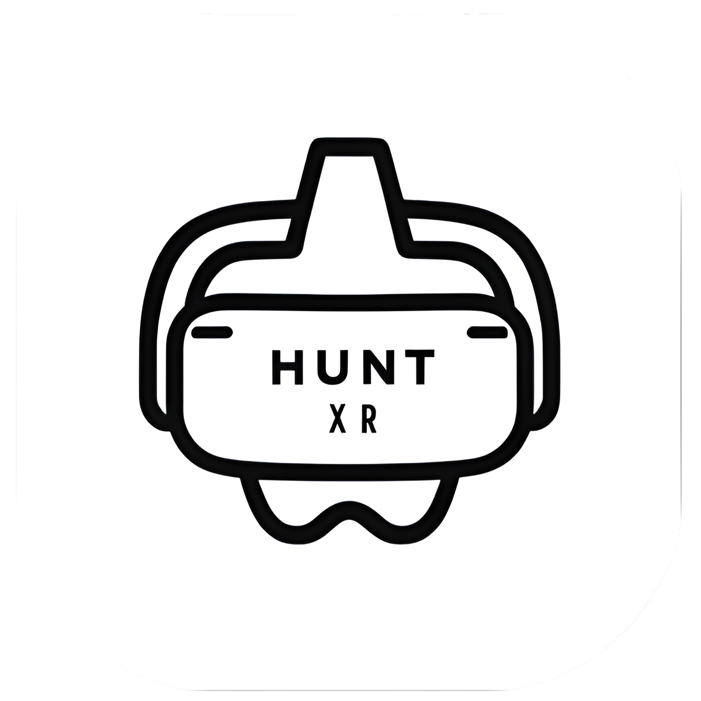

<div align=center>

![views] ![stars] ![forks] ![issues] ![license] ![repo-size]



# HuntXR

HuntXR is a Move to Earn web3 application that rewards users with **$POKE** tokens for physical activities like walking and discovering hidden tokens in real-world locations using augmented reality (AR). Built on the Stacks Blockchain, the app offers unique features such as peer-to-peer token hiding, community token drops, and in-app tokens for various rewards.

## Building from Source

</div>

- Fetch latest source code from master branch.

```
git clone https://github.com/rajput-hemant/hunt-xr
cd hunt-xr
```

- Rename **.env.example** => **.env.local**, add your own environment variables.

- Run the app with VS Code or the command line:

```
bun i
bun dev
```

<div align=center>

## Tech Stack

</div>

- **React XR**: [React XR](https://github.com/pmndrs/xr) is used for AR experiences within the app.
- **Next.js**: A powerful React framework
- **Stacks Blockchain**: [Stacks Blockchain](https://www.stacks.co/build/get-started) provides decentralized infrastructure for the **$POKE** token and smart contract interactions.

<div align=center>

## Features

</div>

### Peers/Friends Token

- **Concept**: Users can hide **$POKE** tokens in real-world locations for friends to find.
- **Workflow**:
  1. Player A selects a location on the app's map.
  2. Player A hides a **$POKE** token using the app's geolocation features.
  3. Friends are notified and can use AR to find the hidden token.
  4. Fitness tracker integration ensures proof of location for earning tokens.

### Community Token Drop

- **Concept**: Communities can airdrop tokens (e.g., $WELSH) at specific locations on the app's map.
- **Workflow**:
  1. Community deposits tokens into the app's smart contract.
  2. Airdrop locations are selected on the map.
  3. Users can find and claim tokens using AR, with additional security measures to prevent spoofing.

### In-App Tokens

- **$POKE**: The main token, earned through walking, hidden token discovery, and more. Can be exchanged for rewards like gift cards or used to enter leaderboards.
- **$#USER**: A unique token for each user, used to hide **$POKE** tokens for others. Limited daily usage and capped supply to maintain token economy.

<div align=center>

## License

This project is licensed under the MIT License - see the [LICENSE](LICENSE) file for details.

## Contributors:

[![][contributors]][contributors-graph]

_Note: It may take up to 24h for the [contrib.rocks][contrib-rocks] plugin to update because it's refreshed once a day._

</div>

<!----------------------------------{ Labels }--------------------------------->

[views]: https://komarev.com/ghpvc/?username=hunt-xr&label=view%20counter&color=red&style=flat
[repo-size]: https://img.shields.io/github/repo-size/rajput-hemant/hunt-xr
[issues]: https://img.shields.io/github/issues-raw/rajput-hemant/hunt-xr
[license]: https://img.shields.io/github/license/rajput-hemant/hunt-xr
[forks]: https://img.shields.io/github/forks/rajput-hemant/hunt-xr?style=flat
[stars]: https://img.shields.io/github/stars/rajput-hemant/hunt-xr
[contributors]: https://contrib.rocks/image?repo=rajput-hemant/hunt-xr&max=500
[contributors-graph]: https://github.com/rajput-hemant/hunt-xr/graphs/contributors
[contrib-rocks]: https://contrib.rocks/preview?repo=rajput-hemant%2Fnextjs-template
